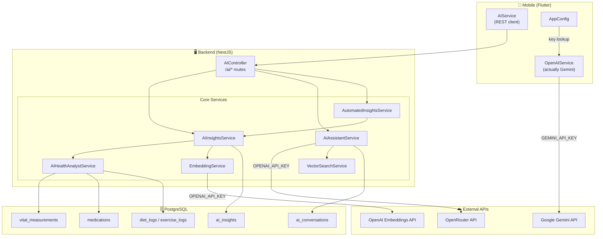
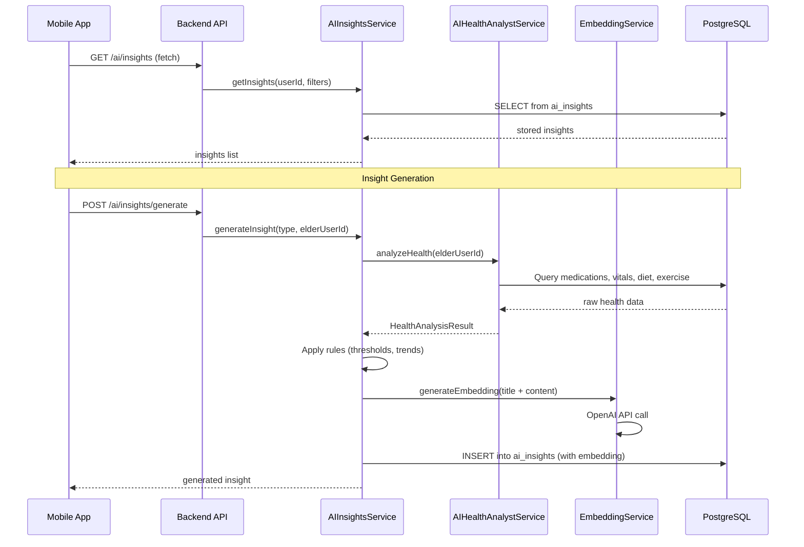

# AI Insights Architecture Overview

## How AI Insights Works

The AI Insights feature has **two independent AI systems** — one on the **mobile** side and one on the **backend** side — serving different purposes.

---

## Architecture Diagram

---

## LLMs Used

| Purpose | LLM / Model | API | API Key |
|---------|-------------|-----|---------|
| **Food & exercise calorie analysis** (mobile) | Google **Gemini Flash** (`gemini-flash-latest`, with fallback chain) | `generativelanguage.googleapis.com/v1beta` | `GEMINI_API_KEY` |
| **AI Chat Assistant** (backend) | OpenRouter **GPT-oss-20b:free** (`openai/gpt-oss-20b:free`) | `openrouter.ai/api/v1` | `OPENAI_API_KEY` |
| **Vector Embeddings** (backend) | OpenAI **text-embedding-3-small** (1536 dimensions) | `api.openai.com/v1` or OpenRouter | `OPENAI_API_KEY` |

---

## API Keys

### 1. `GEMINI_API_KEY` — Mobile Side

- **Used by**: [OpenAIService](file:///c:/Development/DigitalNurse/mobile/lib/core/services/openai_service.dart) (despite the name, it calls Google Gemini)
- **Purpose**: Calorie analysis for food/exercise descriptions on the mobile client
- **Key resolution order** (in [AppConfig](file:///c:/Development/DigitalNurse/mobile/lib/core/config/app_config.dart)):
  1. Database-cached key (stored in SharedPreferences after login)
  2. Environment variable `GEMINI_API_KEY`
  3. User-saved preference
  4. Hardcoded default (empty in production)

### 2. `OPENAI_API_KEY` — Backend Side

- **Used by**: [AIAssistantService](file:///c:/Development/DigitalNurse/backend/src/ai/services/ai-assistant.service.ts) and [EmbeddingService](file:///c:/Development/DigitalNurse/backend/src/ai/services/embedding.service.ts)
- **Purpose**: Powers the AI chat assistant + generates vector embeddings for RAG search
- **Source**: Environment variable in backend [.env](file:///c:/Development/DigitalNurse/backend/.env)
- **Auto-detection**: If the key starts with `sk-or-v1-`, the embedding service automatically switches to OpenRouter's API endpoint

---

## How AI Insights Specifically Works

> [!IMPORTANT]
> The AI Insights feature does **NOT** use an LLM to generate its insights. It uses **rule-based analysis** of the user's health data from the database.

### Flow

### Insight Types (Rule-Based)

| Insight Type | What It Analyzes | Key Rules |
|---|---|---|
| `MEDICATION_ADHERENCE` | Medication intake records | Adherence < 70% → "Low", < 80% → "Needs Improvement" |
| `HEALTH_TREND` | Vital measurements over 30 days | Compares 1st half vs 2nd half averages; > 5% change flags a trend |
| `RECOMMENDATION` | Combined med + health + lifestyle | Aggregates all recommendations from sub-analyses |
| `ALERT` | Risk factors | High-severity risk factors (e.g., BP > 140 systolic) |
| `PATTERN_DETECTION` | Placeholder | Returns static "analyzing patterns" message |

### Automated Generation

[AutomatedInsightsService](file:///c:/Development/DigitalNurse/backend/src/ai/services/automated-insights.service.ts) runs a **daily cron job at 2 AM** that:
1. Queries all active users
2. Generates `MEDICATION_ADHERENCE`, `HEALTH_TREND`, and `RECOMMENDATION` insights for each
3. Cleans up expired insights at 3 AM

Can be toggled via the `ai_insight_generation_enabled` config key in the database.

---

## Where the AI Chat Assistant Uses LLMs

The [AIAssistantService](file:///c:/Development/DigitalNurse/backend/src/ai/services/ai-assistant.service.ts) **does** use an actual LLM — it's the chat feature (separate from Insights). It:

1. Uses **RAG** (Retrieval-Augmented Generation): queries the vector database for relevant health data based on the user's question
2. Builds a system prompt with the retrieved context (medications, vitals, caregiver notes)
3. Sends to **OpenRouter** (`openai/gpt-oss-20b:free`) for a response
4. Stores the conversation in `ai_conversations` / `ai_conversation_messages` tables

---

## Summary

- **AI Insights = Rule-based** (no LLM), analyzes database health records using thresholds and trend calculations
- **AI Chat = LLM-powered** via OpenRouter (`gpt-oss-20b:free`)
- **Food/Exercise Calorie Analysis = LLM-powered** via Google Gemini (mobile-side)
- **Embeddings = OpenAI** `text-embedding-3-small` for vector search (RAG)
